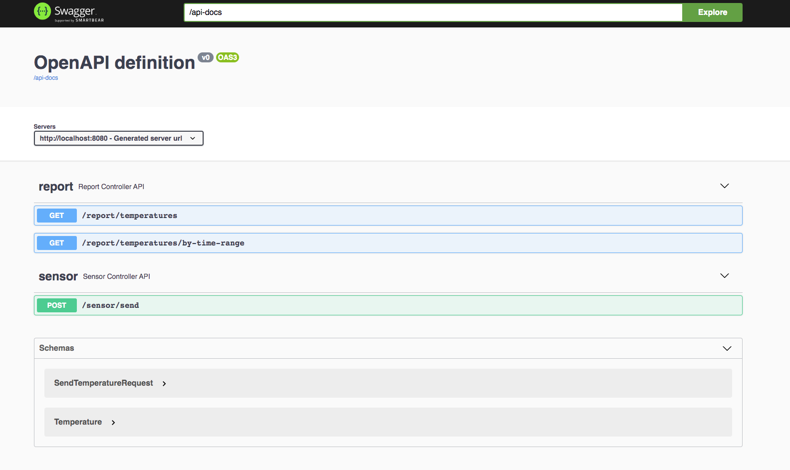
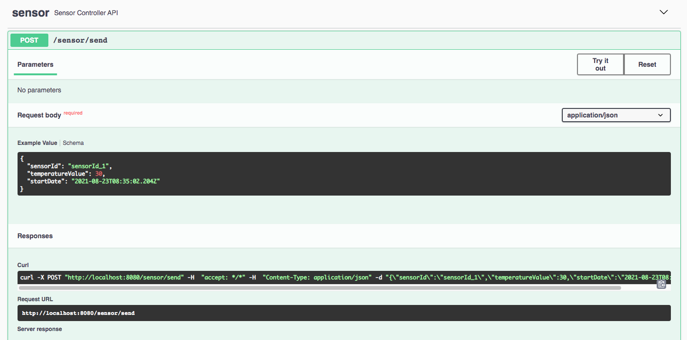
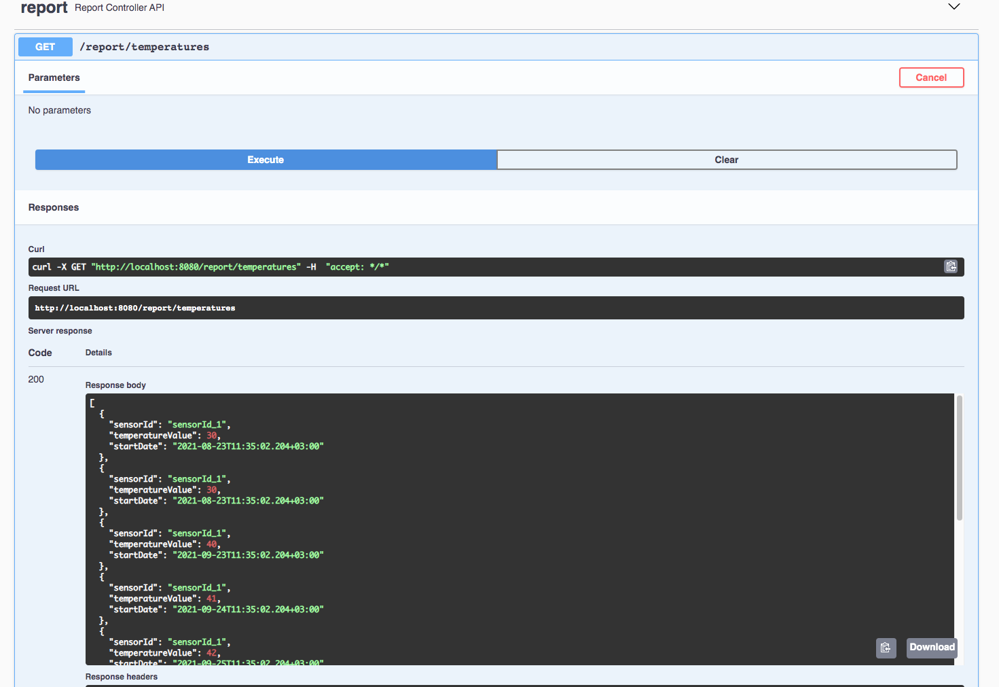
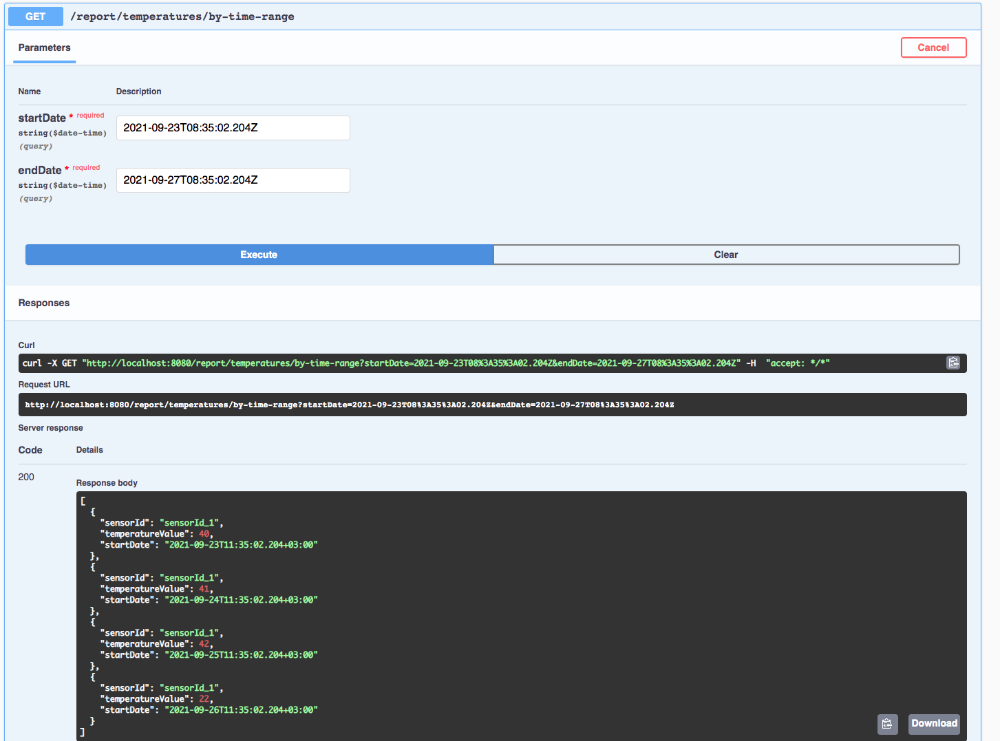
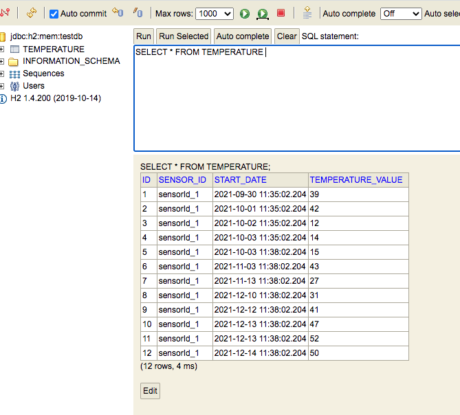

# Teperature Sensor API

Teperature Sensor API canbe be used by a client connected to a temperature sensor. The sensor sends to the client a continuous stream of temperature data. It's possible for the client not to have an internet connection in which case, the data is stored locally and synchronized, in bulk, to the API as soon as the network connection is established. The client displays this information in a chart where data can be seen per hour or daily, however since the client has resource limitations, it relies on the API to aggregate data.

 

## Installation
   
### Minimum Specification
 
 - **Java 11** or latest 
 - docker-compose
 - maven

 

### Build & Run

**infastructure :**   
docker-compose up .

 

**application :**   
./mvnw clean install  
./mvnw  spring-boot:run
 
  

## Technology Stack

- Java 11
- Spring Boot 
- Spring Data
- Apache Kafka
- Lombok
- H2 in-memory db

## API documentation

You can access the Swagger API documentation using the link below.  
http://localhost:8080/swagger-ui.html  

 

**Swagger Implementation :**  

 

### Save temperature data

 

### Get all aggregated temperature data

 

### Get all aggregated temperature data by time range

 

## In-Memory Database

You can access the H2 In-Memory Database using the link below.  
http://localhost:8080/h2 

 